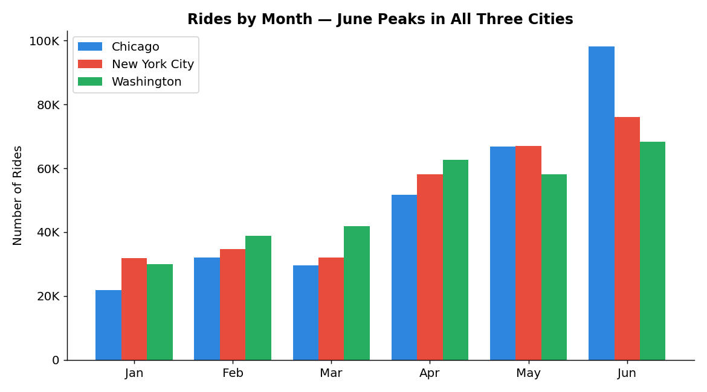
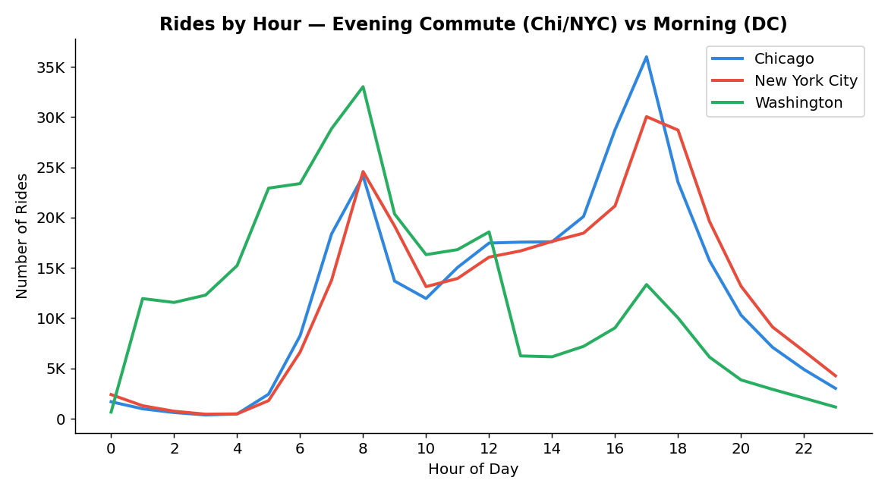
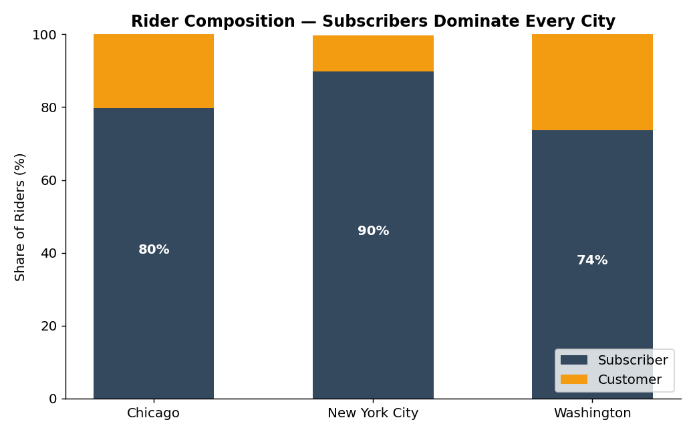

# 🚲 Bike Share Data Analysis

> **An interactive Python tool that lets a user explore US bike-share data (Chicago, New York City, Washington) and computes usage statistics on demand using Pandas.**


---

## 📌 Project Overview

This project explores bike-share data from three US cities to identify trends in rider behavior, travel patterns, and trip characteristics. `bikeshare.py` is an interactive command-line program: the user picks a city and time filters, and the script computes and displays the relevant statistics using Pandas.

*Completed during the Udacity Data Analyst Nanodegree (based on the Programming for Data Science project template).*

---

## 🎯 Questions the Tool Answers

**Time trends** — busiest months, most active days of the week, peak start hours
**Station trends** — most popular start/end stations and most common trip routes
**Trip duration** — total and average travel time
**User demographics** — user-type counts, gender breakdown, and birth-year stats (where available)

---

## 🛠 Tools & Skills Demonstrated

**Python:** functions · conditional logic · loops · user input handling
**Data analysis:** Pandas · NumPy · filtering · aggregations · descriptive statistics · EDA

---

## 📈 Key Findings

*Based on 300,000 trips per city.*

| Metric | Chicago | New York City | Washington |
| ------ | ------- | ------------- | ---------- |
| Busiest month | June | June | June |
| Busiest day | Tuesday | Wednesday | Wednesday |
| Peak hour | 5 PM | 5 PM | 8 AM |
| Top start station | Streeter Dr & Grand Ave | Pershing Square North | Columbus Circle / Union Station |
| Avg. trip duration | 15.6 min | 15.0 min | 20.6 min |
| Subscriber share | 79.6% | 89.7% | 73.6% |

**What stands out:**

- **June was the single busiest month in all three cities** — a clear early-summer ridership peak.
- **Commuting patterns differ by city:** Chicago and NYC peak at **5 PM** (evening commute), while Washington peaks at **8 AM** (morning commute).
- **Subscribers dominate everywhere**, from 73.6% in Washington to **89.7% in NYC** — these are primarily regular-rider systems, not tourist-driven.
- **Washington riders take the longest trips** (20.6 min avg vs. ~15 min elsewhere), suggesting longer commute distances.
- The busiest stations are transit hubs and downtown landmarks (Union Station, Pershing Square, Streeter Dr), pointing to strong commuter demand.

---

## 📊 Visualizations

*Charts generated from the raw trip data (300,000 trips per city).*

**Rides by month** — ridership climbs through spring and peaks in June across all three cities.



**Rides by hour** — Chicago and NYC peak at 5 PM (evening commute), while Washington peaks at 8 AM (morning commute).



**Rider composition** — subscribers dominate every city, from 74% in Washington to 90% in NYC.



---

## 🚀 How To Run

```bash
# 1. Clone the repository
git clone https://github.com/Rozaay12/udacity-bikeshare-data-analysis.git
cd udacity-bikeshare-data-analysis

# 2. Install dependencies
pip install pandas numpy

# 3. Add the data files (see note below), then run
python bikeshare.py
```

> **Note on data:** the city CSV files (`chicago.csv`, `new_york_city.csv`, `washington.csv`) are excluded from this repo via `.gitignore` because they are large Udacity-provided datasets. Place them in the project root before running.

---

## 📂 Repository Structure

```
udacity-bikeshare-data-analysis/
│
├── bikeshare.py     # Interactive analysis script
├── .gitignore       # Excludes large city CSV datasets
└── README.md
```

---

## 👤 Author

**Michael Jon-Baptiste** — Data Analyst
SQL · Python · Pandas · Excel · Tableau · Git

🔗 GitHub: https://github.com/Rozaay12 · LinkedIn: [FILL IN]

⭐ Continuously building projects and improving analytical skills.
